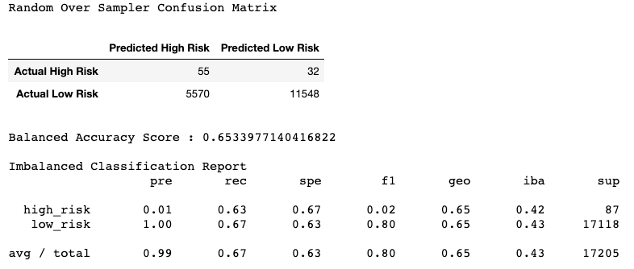
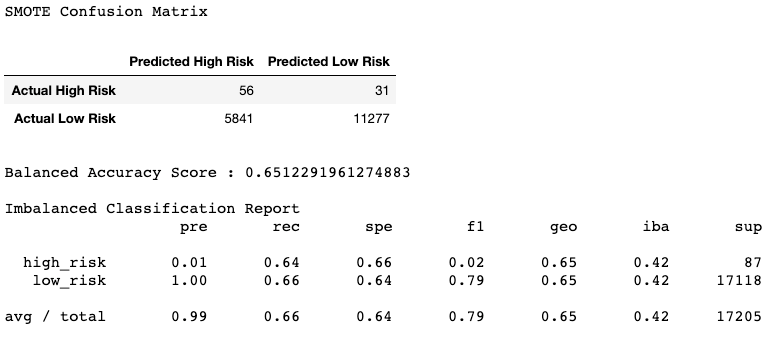
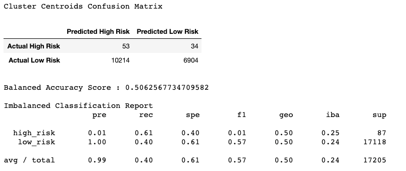
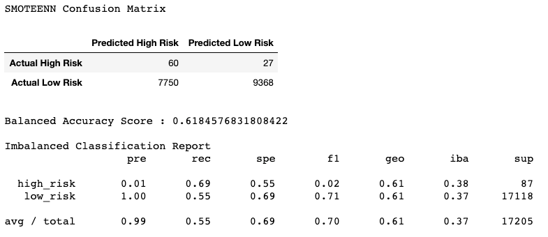
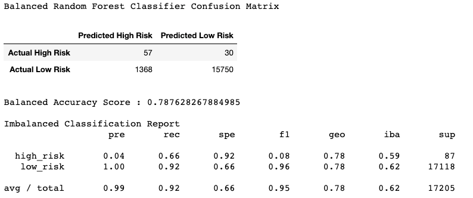
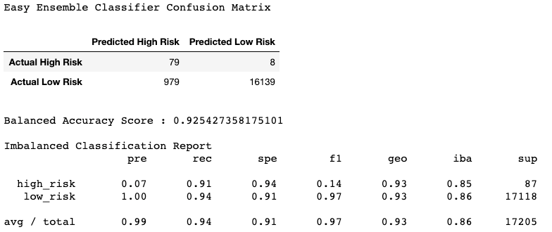

# Supervised Machine Learning
## Objective
The goal of this repository is to build and evaluate several machine learning models to assess credit risk, using data from LendingClub; a peer-to-peer lending services company.
* Implement machine learning models.
* Use resampling to attempt to address class imbalance.
* Evaluate the performance of machine learning models.

## Resources
* Notebook/credit_risk_resampling.ipynb
* Notebook/credit_risk_ensemble.ipynb
* Resources/LoanStats_2019Q1.csv.zip

## Results

### RandomOverSampler

This model produced a balanced accuracy score of 0.65, a high precision score of 0.01, a high recall score of .63 and an average f1 score of 0.80. The recall score is on the lower end and indicates the model is not accurate enough to predict high risk borrowers. 

### SMOTE

This model produced a similar degree of accuracy as random over sampling with a balanced accuracy score of 0.65, a high precision score of 0.01 and a high recall score of .64. While the SMOTE recall score is slightly higher, tthis model is not precise enogh to predict credit worthiness to acceptable degree.

### Cluster Centroids

This model produced a balanced accuracy score of 0.51, a high precision score of 0.01, a high recall score of .61 and an average f1 score of 0.57. This is the worst performing model of all studies performed likely due to fewer observations caused by under sampling. Cluster centroids should not be used to predict credit worthiness.

### SMOTEENN

This model produced a balanced accuracy score of 0.62, a high precision score of 0.01, a high recall score of .69 and an average f1 score of 0.70. The recall score is the highest of all models thus far yet still not accurate enogh to make informed data driven decisions. 

### BalancedRandomForestClassifier

This model produced a balanced accuracy score of 0.79, a high precision score of 0.04, a high recall score of .66 and an average f1 score of 0.95. The recall score is on the lower end and indicates the model is not accurate enogh to predict high risk borrowers. 
This model shows potential with a high f1 score however a high risk recall of .66 indicated the model is lacking in accuracy. 

### EasyEnsembleClassifier

This model produced a balanced accuracy score of 0.93, a high precision score of 0.07, a high recall score of .91 and an average f1 score of 0.97. The combination of multiple learning models improves the accuracy score dramatically making this the best performing model in the study. 

## Recommendation
We recommend the loan underwritting data scientist use an ensemble learning approach to asses credit risk. This technique combines decisons from multiple models to improve overall performance. 